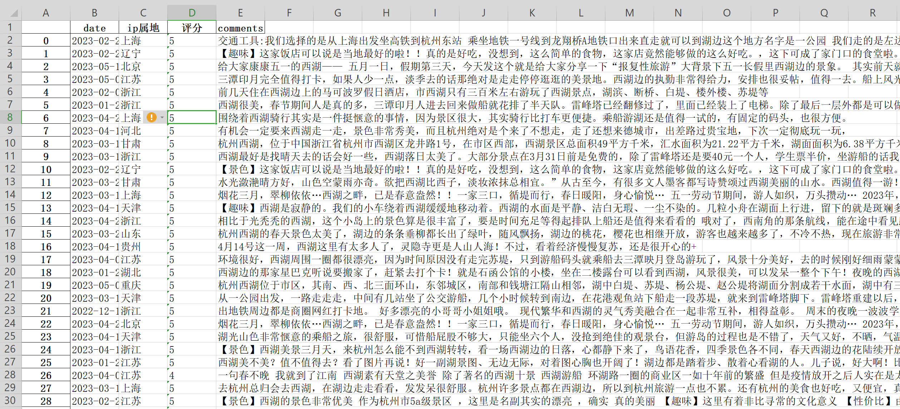

# Spider_XieCheng
Python爬取携程景区评论的相关信息，供学习研究 **有问题直接issues或者juanyantangyu@163.com，论文亦可!!**

**chromedriver.exe**,下载,这个看自己安装的Google的版本，自带匹配版本下载链接：https://www.slimjetbrowser.com/chrome/files/103.0.5060.53/ChromeStandaloneSetup.exe
下载解压后放到当前代码路径下。下载地址 http://chromedriver.storage.googleapis.com/index.html

## 本项目使用chromed版本：Version 103.0.5060.53 (Official Build) (32-bit)版本要和Chromedriver.exe一致，否则不能使用！！！

**例如：时间、ip属地、文本、评分等！**

